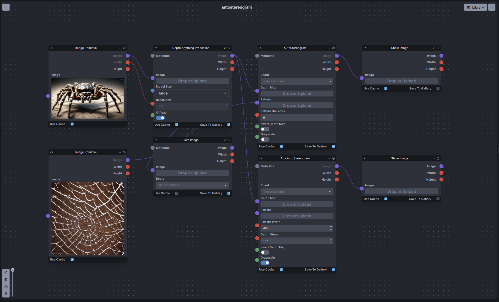

# autostereogram-nodes
InvokeAI nodes to generate autostereogram images from a depth map.  This is not a very useful node but more a 90s nostalgic indulgence as I used to love these images as a kid. 

## Usage
<ins>Install:</ins> 
There are two options for installing these nodes. (Option 1 is the recommended option) 
1. Git clone the repo into the `invokeai/nodes` directory. (**Recommended** - as it allows updating via a git pull)
    - open a command prompt/terminal in the invokeAI nodes directory ( or choose `8. Open the developer console` option from the invoke.bat then `cd nodes`)
    - run `git clone https://github.com/skunkworxdark/autostereogram_nodes.git`
2. Manually download and place [autostereogram.py](autostereogram.py) & [__init__.py](__init__.py) in a subfolder in the `invokeai/nodes` folder.

<ins>Update:</ins> 
Run a `git pull` from the `autostereogram_nodes` folder. Or run the `update.bat` or `update.sh` that is in the `invokeai/nodes/autostereogram_nodes` folder. If you installed it manually then the only option is to monitor the repo or discord channel and manually download and replace the file yourself.

<ins>Remove:</ins> 
Simply delete the `autostereogram_nodes` folder or you can rename it by adding an underscore `_autostereogram_nodes` and Invoke will ignore it.

## Nodes
This pack consists of two nodes `Autosteteogram` and `Adv Autostereogram`.

<ins>Common inputs</ins> 
- Board: Board name to save images to.
- Depth Map: The grayscale depth map to convert into.
- Pattern: Optional image to use as the background pattern for the autostereogram. If no image is provided random dots will be used.
- Invert Depth Map: Inverts the depth map. This has the impact of inverting the direction of the 3D effect. It is also the difference between crossing or uncrossing your eyes to view the image.
- Grayscale: Convert the output to grayscale.

<ins>Autostereogram</ins> 
- Pattern Divisions: How many times the pattern repeats in output images 5-10 is in generally a good range. The lower the repeats the greater the depth effect but the harder it is to see.

<ins>Adv Autostereogram</ins> 
- Pattern Width: The width to rescale the pattern. As a guide 5-10 pattern repeats across the output image is a good start.
- Depth Steps: The number of depth steps, 30-127 is a good range. A good starting point is to have the number of steps be around half of the pattern width.

## Examples
Take an image and create a depth map from it then feed it into the autostereogram node along with an optional pattern image.

Workflow example [autostereogram.json](workflows/autostereogram.json)

 

 

Example background patterns. These were generated in InvokeAI using the seamless tiling option and the prompt "a random spiderweb pattern". Good patterns will have quite a lot of small details across the x-axis of the image and will avoid large blocks of single color. 

